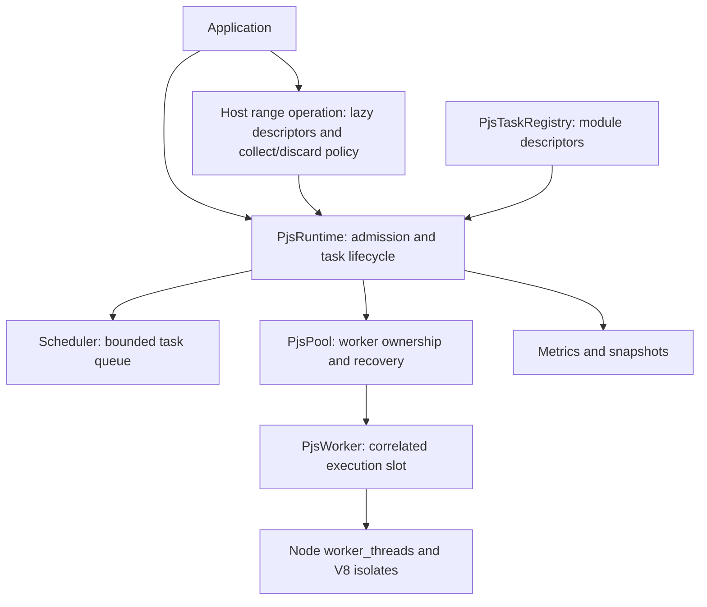

# Runtime architecture

The [initial proposal](proposal.md) defines the boundaries. The public package exports `PjsRuntime`, `PjsTaskRegistry`, `transfer`, `sharedReadonly`, task/transfer/option/snapshot types, and errors. Pool, worker transport, FIFO implementation, mutable task records, metrics accumulator, internal profiling hooks, and protocol are internal modules. Package exports prevent accidental dependence on these internals. v0.2 adds explicit buffer ownership; v0.3 adds shared-input construction; v0.4 adds an experimental main-isolate range coordinator; v0.5 adds experimental bounded dispatch batching; v0.6 adds completion-only ranges and operation-level async context; v0.7 adds bounded completion-order result streams; v0.8 adds element-block mapping and diagnostic queued-payload bytes. FIFO policy and the worker population model remain unchanged.

## Ownership and scheduling

The main isolate owns task settlement, worker state, and dispatch decisions. Each worker owns one active execution and a private module registry. Promise continuations, worker messages, timer callbacks, and abort callbacks serialize through the main event loop. Input getters invoked by structured clone can re-enter the public API synchronously, so dispatch claims its slot before cloning.

`PjsScheduler` implements a `Scheduler<T>` interface with enqueue, next(worker snapshot), removal, size, and capacity. A Map supplies insertion-order FIFO and direct queued cancellation without an ever-growing tombstone array. Idle slots can accept tasks directly only when the queue is empty. A serialization failure frees its slot synchronously and dispatch continues. Completion order across workers is deliberately unspecified; FIFO describes dispatch order.

The pool has no queue knowledge. Future policies can use task metadata and worker snapshots without changing worker transport. Priority queues need admission/removal semantics preserved. Work stealing will require a larger dispatch-ownership change; the FIFO interface alone is not a claim that distributed deques are a drop-in replacement.

## Lifecycle and invariants

Runtime: `created → starting → running → stopping → stopped`. Fatal infrastructure errors lead to `failed`; resources are stopped automatically, and an awaited shutdown finishes in `stopped`. Readiness means every initial worker imported every registered export, not merely that OS threads were launched. Startup can accept bounded work, but normal dispatch waits for readiness. Graceful shutdown during startup may dispatch as workers become ready while the remaining workers start.

Pool: `created → active → stopping → stopped`. A fixed population is selected within min/max bounds at construction. Workers persist until shutdown or failure. There is no idle shrinking, per-task spawning, or hidden nested pool.

Worker: `starting → idle ↔ busy`; crash/protocol/bootstrap error → `failed`; termination → `stopped`. Replacement has a fresh monotonically increasing runtime worker ID and a Node thread ID. The old thread exits before the new one is spawned. An error followed by an exit counts as one failure. Historical worker objects are discarded on replacement; lifetime failure counters remain.

Task: `created → queued → scheduled → running → completed | failed`; any nonterminal accepted state may become `cancelled | timed_out`. `started` is an explicit protocol acknowledgement. Every accepted task has a UUID. Terminal settlement deletes the runtime record, removes it from the queue, removes its abort listener, clears its timer, releases the retained input, and resolves or rejects once. Returned errors retain task IDs. Completed records are not retained indefinitely.

The crucial distinction is caller settlement versus execution completion. A cancelled/timed-out running task has no remaining promise bookkeeping, but its worker retains the task ID until its result or crash. Late responses release that slot without touching the settled promise. Thus `tasks.pending` may be zero while `workers.busy` is positive. Runtime draining checks both, plus live partition operations.

## Task contract and protocol

Registration binds a typed handle to a local file URL and named/default function export. Each runtime snapshots the registry; later registrations require a new runtime. Bootstrap imports once per isolate and checks exports are callable. TypeScript handles assert types; they cannot prove the module matches. Tasks accept one serializable input and return a result, a `transfer(value, buffers)` envelope, or a promise of either. The registered output type describes the caller-visible value. All task-owned async work must finish before the task returns.

Protocol version 2 retains ordinary `execute`, internal `executeBatch { batchId, taskName, items }`, and an explicit completion-only marker. Collecting workers answer with ordinary success values. Completion workers answer `completed` without inspecting, transferring, or serializing the task return value. Batch results contain ordered per-task success/completion records, at most one final failure, and any later skipped IDs. `ready`, `started`, shutdown, and bootstrap failure remain versioned and validated. Batch IDs identify physical occupancy; task IDs retain logical identity. Missing, duplicate, reordered, or unknown IDs, an invalid failure shape, or any response for the wrong occupied slot fails the worker. Registered module exports remain the only executable code.

Payload serialization lives in `PjsWorker.execute()` and bootstrap result posting. v0.2 passes transfer lists through these boundaries; lists are local postMessage options and do not change the wire protocol. Worker bootstrap recognizes envelopes through an isolate-local WeakMap and sends only their values. Ordinary objects with fields such as `value` or `transferList` are not treated as envelopes. No eval, source-string serialization, or dynamic compilation is used. Imported modules are trusted; this is not an isolation boundary for hostile JavaScript.

## Admission, deadlines, and cancellation

`maxQueue` bounds waiting task count, not bytes. Accepted work is bounded by queue capacity plus execution slots. Large inputs still require application memory budgeting. Ordinary run() has no admission waiters. Overflow returns `PjsQueueFullError`. During startup, work consumes waiting capacity.

Timeouts start at acceptance, include queue delay, and use Node timers with integer delays from 1 to 2³¹−1 ms. Delivery depends on event-loop progress; deadlines are not hard real-time CPU preemption. Abort before admission rejects without accepting work. Queued cancellation/deadline removes work. Active cancellation/deadline settles the caller but preserves the slot. No task is retried automatically; side effects may already have occurred.

## Range coordinator, result policies, and batching (v0.4-v0.8, experimental)

`partitionRange()`, `parallelFor()`, `streamRange()`, and `parallelMapRange()` describe a safe integer half-open range with an explicit grain and synchronous host payload factory. `partition/range.ts` validates the plan and generates immutable descriptors; `partition/operation.ts` owns parent state, result policy, and one `PjsRangeOperation` AsyncResource. Runtime integration handles admission, production and child settlement. Collecting mode allocates an indexed output array. Discard mode allocates none and resolves `void`. Stream mode uses a single-consumer `AsyncIterable` coordinator and yields `{ partition, output }` in completion order. Map mode preallocates one flat element result and copies validated partition blocks into their logical offsets.

Parents follow `created → running → completed | failed | cancelled | timed_out`, with running including startup/capacity waiting. Parents occupy no worker or FIFO slot. At most `min(MAX_SAFE_INTEGER, workers + maxQueue)` parent records are accepted. Batch size 1 retains the v0.4 worker-count live-child window. A configured batch size `B` permits at most `workers × B` live logical children for that parent, while the FIFO counts each queued batch by its logical weight. Thus waiting logical work remains at most `maxQueue`; physical queue nodes may be fewer. Production stages at most `B` descriptors per physical dispatch and at most worker-count physical batches per synchronous turn. It never materializes a whole range.

One physical batch contains only children from the same parent operation and registered task. Its items execute sequentially in one worker. Successes settle by logical task ID and parent outputs remain ordered by partition index. On first item failure, later items do not execute; the parent fails once and other sibling callers are cancelled. A crash is attributed to the batch leader and follows the existing no-retry rule because partial side effects are unknowable. Cancellation removes queued weighted batches but cannot preempt a posted one; the full posted batch finishes unless an item fails.

Input transfer lists are rejected before detachment whenever configured batch size exceeds one. This preserves per-child transfer ownership rather than moving buffers for logical items that may never execute. Shared and cloned inputs batch normally. Output transfer envelopes may be combined in one result message because those buffers are worker-owned. Use batch size one for transfer-owned matrix inputs.

Collecting results are stored by logical index and returned only after every chunk succeeds. Their memory grows with completed outputs; `maxQueue` is a task bound, not a result-byte bound. Map workers return exactly one ordinary-array or explicitly selected typed-array block element per range index. The host validates cardinality/kind, copies directly into a flat preallocated result at `partition.start - range.start`, and never exposes partial output. Completion results are discarded inside workers and never enter a host output array. A stream's separate `experimentalMaxBufferedResults` credit bound covers buffered plus admitted-unsettled logical results. Consumer reads release credits and repump the shared FIFO; physical batches cannot exceed available credits. Workers are released after host settlement rather than being held by a slow consumer.

Stream success includes delivery of every result. Consumer close cancels remaining work, while producer failure preserves already-yielded values and discards buffered ones. Streams begin eagerly at API call. Directly buffered ArrayBuffer/SAB/view results contribute visible `byteLength` diagnostics; scalars, arrays, objects, and nested graphs count as unknown without traversal. These fields are not a hard byte limit or unique-memory estimate. A single deadline covers consumer waiting, and graceful shutdown waits for delivery; an abandoned, unclosed iterator can therefore prevent a draining shutdown from finishing. First failure cancels siblings without freeing occupied workers. Worker-created range operations reject explicitly; no parent compute slot waits for children. General nested parallelism is unsupported.

Graceful shutdown finishes the entire accepted logical range, including ungenerated work. Non-draining shutdown cancels parents before remaining ordinary tasks. Fatal runtime failure rejects every live parent. See the [usage contract](partitioning.md), [ADR 0008](adr/0008-runtime-owned-partitioning.md) and [admission ADR](adr/0009-partition-admission-and-metrics.md).

## Failure and shutdown

Task exceptions become `PjsTaskError` with remote name, message, and stack plus local task/worker IDs. Input/output clone or transfer failures become `PjsSerializationError`; they do not normally damage the worker. Invalid lists rejected before admission count as rejected tasks; serialization failures at dispatch or result posting count as failed accepted tasks. Crashes, protocol violations, startup errors, and replacement exhaustion become `PjsWorkerError`. Registration, admission, runtime state, cancellation, and deadlines have distinct exported errors. Uninspectable thrown values use a safe fallback description.

An unexpected exit, including exit code zero, fails the occupied task and replaces the worker while the pool remains active. Queue entries survive. Bootstrap failures are fatal immediately, because repeatedly importing invalid configuration is not recovery. Runtime-wide replacement count is bounded to prevent a hot crash loop. Exhaustion fails accepted work with task-specific errors and stops the pool.

Graceful shutdown synchronously closes admission, waits for accepted tasks and outstanding executions, then stops workers and removes thread listeners. The shutdown control message closes the bootstrap port; host termination guarantees task-created stray resources cannot retain the process. Async user finalizers are not a supported shutdown hook. Explicit `drain: false` rejects accepted work and terminates workers, including busy ones. Concurrent calls share one promise and the first chosen mode. A permanently busy task requires choosing non-draining shutdown initially; escalation of an already-running graceful shutdown is not in v0.2.

## Memory and observability

Structured clone is the default on input dispatch and output posting. Explicit `run(..., { transferList })` lists and output `transfer(value, list)` envelopes move ArrayBuffer backing memory. Typed-array metadata and enclosing objects still require serialization. Queued inputs are retained by reference until dispatch; mutation, resizing, or external transfer before settlement is outside the contract.

Lists are copied at submission and validated both then and immediately before posting. Only live, unique ArrayBuffers that Node permits to transfer are accepted. A module-level WeakMap reserves queued input buffers across runtimes using the same library instance. Every claim is checked before any is written. Cancellation/failure before dispatch releases reservations without detachment. Successful posting detaches every sender-side view; task failure, crash, timeout, or shutdown cannot reverse it. Reservations remain held during a reentrant abort from a payload getter, and are released in dispatch's finally block. No graph walk is used to check buffer reachability; a listed buffer must also occur in the payload to be usable by the receiver. See [ADR 0005](adr/0005-transfer-ownership.md).

Typed-array subviews can clone or transfer a whole backing buffer, so benchmarks explicitly build compact row blocks. Transferring the right matrix to several workers needs a dedicated copy for each worker; those costs are timed and reported. SharedArrayBuffer can pass through naturally but cannot be transferred. PJS supplies no race-safety guarantees or synchronization API for shared data. v0.3 adds `sharedReadonly` construction and a read-only usage contract over native SAB transport; see [the memory guide](memory.md) and [ADR 0007](adr/0007-shared-input-model.md). There is no resource registry or disposal: GC manages references, and replacement workers receive shared backing through subsequent task messages. Read-only is not enforced protection. Cancellation does not end active access. maxQueue does not bound shared bytes; no hidden compute jobs or speculative byte metrics are added.

Snapshots are copies. `operations` counts parent outcomes independently and exposes collecting/completion/streaming/mapping breakdowns; `streams` aliases streaming parent outcomes. `streamResults` reports produced, yielded, current/peak aggregate buffered logical results, current/peak known visible payload bytes, and current/peak unknown result counts. `mapResults` reports validated blocks/elements and cumulative host assembly time. `partitions` counts generated/admitted logical children and their completed/failed/cancelled callers. `tasks` remains logical and includes ordinary plus range children. The separate `dispatch` namespace counts execute messages, result messages, batched execute messages, logical tasks, logical partitions, and their average per execute. Parent timeouts cancel children, so `operations.timedOut` and `tasks.cancelled` describe different levels. `activeOperations` exposes `resultMode`, stream buffer/byte progress, map assembly progress, and queued/running children from live records; terminal history is not retained. `workers.details` counts logical item outcomes, including late responses. Worker crashes increment failure counters without inventing missing execution durations.

Queue latency is monotonic acceptance-to-physical-dispatch time, including startup; every logical item in a batch receives a sample. Execution latency is measured per logical invocation inside a worker, excluding result posting. Total latency remains acceptance-to-caller settlement. Counts for each mean are exposed; an empty mean is zero with zero samples. Disabled-by-default internal benchmark hooks measure selected stages but are not exported and overlap, so their durations cannot be summed. One operation-level AsyncResource runs host factories and parent settlement in the caller's captured async scope and emits destroy on cleanup. Worker isolates do not inherit AsyncLocalStorage stores; only explicit task input crosses that boundary. See [ADR 0013](adr/0013-async-resource-context.md).

## Next layers

Use the [v0.8 measurements](benchmarks-v0.8.md) to select the next milestone. The experimental range, completion, streaming, mapping, and batching options do not stabilize reduce or a parallel namespace. A declared-size binary result mode is a candidate for turning diagnostics into pre-dispatch byte reservations; arbitrary object graphs remain unsuitable. Cooperative cancellation needs a task context and polling semantics for synchronous kernels. Nested execution needs shared runtime capacity and dependency handling to prevent starvation/deadlock. Work stealing, adaptive chunking, affinity, NUMA, and priorities still lack supporting evidence. Ordinary Node async I/O stays outside CPU task scheduling.
