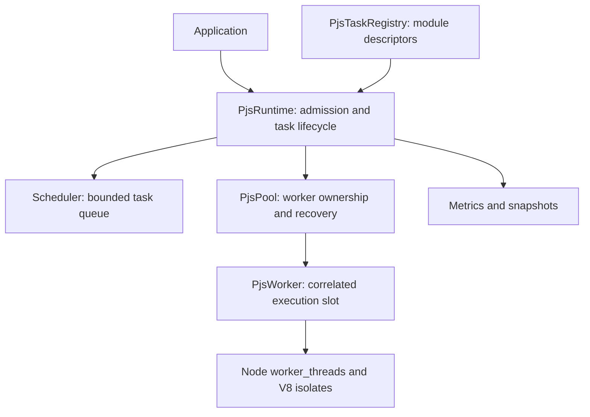

# Runtime architecture

The [initial proposal](proposal.md) defines the boundaries. The public package exports `PjsRuntime`, `PjsTaskRegistry`, task/option/snapshot types, and errors. Pool, worker transport, FIFO implementation, mutable task records, metrics accumulator, and protocol are internal modules. Package exports prevent accidental dependence on these internals.

## Ownership and scheduling

The main isolate owns task settlement, worker state, and dispatch decisions. Each worker owns one active execution and a private module registry. Promise continuations, worker messages, timer callbacks, and abort callbacks serialize through the main event loop. Input getters invoked by structured clone can re-enter the public API synchronously, so dispatch claims its slot before cloning.

`PjsScheduler` implements a `Scheduler<T>` interface with enqueue, next(worker snapshot), removal, size, and capacity. A Map supplies insertion-order FIFO and direct queued cancellation without an ever-growing tombstone array. Idle slots can accept tasks directly only when the queue is empty. A serialization failure frees its slot synchronously and dispatch continues. Completion order across workers is deliberately unspecified; FIFO describes dispatch order.

The pool has no queue knowledge. Future policies can use task metadata and worker snapshots without changing worker transport. Priority queues need admission/removal semantics preserved. Work stealing will require a larger dispatch-ownership change; the FIFO interface alone is not a claim that distributed deques are a drop-in replacement.

## Lifecycle and invariants

Runtime: `created → starting → running → stopping → stopped`. Fatal infrastructure errors lead to `failed`; resources are stopped automatically, and an awaited shutdown finishes in `stopped`. Readiness means every initial worker imported every registered export, not merely that OS threads were launched. Startup can accept bounded work, but normal dispatch waits for readiness. Graceful shutdown during startup may dispatch as workers become ready while the remaining workers start.

Pool: `created → active → stopping → stopped`. A fixed population is selected within min/max bounds at construction. Workers persist until shutdown or failure. There is no idle shrinking, per-task spawning, or hidden nested pool.

Worker: `starting → idle ↔ busy`; crash/protocol/bootstrap error → `failed`; termination → `stopped`. Replacement has a fresh monotonically increasing runtime worker ID and a Node thread ID. The old thread exits before the new one is spawned. An error followed by an exit counts as one failure. Historical worker objects are discarded on replacement; lifetime failure counters remain.

Task: `created → queued → scheduled → running → completed | failed`; any nonterminal accepted state may become `cancelled | timed_out`. `started` is an explicit protocol acknowledgement. Every accepted task has a UUID. Terminal settlement deletes the runtime record, removes it from the queue, removes its abort listener, clears its timer, releases the retained input, and resolves or rejects once. Returned errors retain task IDs. Completed records are not retained indefinitely.

The crucial distinction is caller settlement versus execution completion. A cancelled/timed-out running task has no remaining promise bookkeeping, but its worker retains the task ID until its result or crash. Late responses release that slot without touching the settled promise. Thus `tasks.pending` may be zero while `workers.busy` is positive. Runtime draining checks both.

## Task contract and protocol

Registration binds a typed handle to a local file URL and named/default function export. Each runtime snapshots the registry; later registrations require a new runtime. Bootstrap imports once per isolate and checks exports are callable. TypeScript handles assert types; they cannot prove the module matches. Tasks accept one cloneable input and return a cloneable result or a promise of one. All task-owned async work must finish before the task returns.

Host messages: `execute { taskId, taskName, input }`, `shutdown`. Worker messages: versioned `ready`, `started { taskId }`, `success { taskId, output, executionMs }`, `failure { taskId, kind, error, executionMs }`, `bootstrapFailure { error }`. Both endpoints validate messages at runtime. Each task response must match the occupied slot and legal execution phase. Invalid, duplicate, or mismatched responses fail that worker. Message ordering is checked within a task; dispatch does not assume completion ordering across workers.

Payload serialization lives in `PjsWorker.execute()` and bootstrap result posting. These are the future ownership/transfer boundaries. No eval, source-string serialization, or dynamic compilation is used. Imported modules are trusted; this is not an isolation boundary for hostile JavaScript.

## Admission, deadlines, and cancellation

`maxQueue` bounds waiting task count, not bytes. Accepted work is bounded by queue capacity plus execution slots. Large inputs still require application memory budgeting. There are no hidden admission waiters. Overflow returns `PjsQueueFullError`. During startup, work consumes waiting capacity.

Timeouts start at acceptance, include queue delay, and use Node timers with integer delays from 1 to 2³¹−1 ms. Delivery depends on event-loop progress; deadlines are not hard real-time CPU preemption. Abort before admission rejects without accepting work. Queued cancellation/deadline removes work. Active cancellation/deadline settles the caller but preserves the slot. No task is retried automatically; side effects may already have occurred.

## Failure and shutdown

Task exceptions become `PjsTaskError` with remote name, message, and stack plus local task/worker IDs. Input/output clone failures become `PjsSerializationError`; they do not normally damage the worker. Crashes, protocol violations, startup errors, and replacement exhaustion become `PjsWorkerError`. Registration, admission, runtime state, cancellation, and deadlines have distinct exported errors. Uninspectable thrown values use a safe fallback description.

An unexpected exit, including exit code zero, fails the occupied task and replaces the worker while the pool remains active. Queue entries survive. Bootstrap failures are fatal immediately, because repeatedly importing invalid configuration is not recovery. Runtime-wide replacement count is bounded to prevent a hot crash loop. Exhaustion fails accepted work with task-specific errors and stops the pool.

Graceful shutdown synchronously closes admission, waits for accepted tasks and outstanding executions, then stops workers and removes thread listeners. The shutdown control message closes the bootstrap port; host termination guarantees task-created stray resources cannot retain the process. Async user finalizers are not a supported shutdown hook. Explicit `drain: false` rejects accepted work and terminates workers, including busy ones. Concurrent calls share one promise and the first chosen mode. A permanently busy task requires choosing non-draining shutdown initially; escalation of an already-running graceful shutdown is not in v0.1.

## Memory and observability

Structured clone occurs once on input dispatch and once on output posting. Queued inputs are retained by reference until dispatch; caller mutation before settlement is outside the contract. Typed-array subviews can clone a whole backing buffer, so the matrix benchmark explicitly builds compact row blocks and records the copy costs. SharedArrayBuffer can pass through naturally, but PJS supplies no race-safety guarantees or synchronization API for it. Explicit transfer ownership and reusable shared read-only data are future work.

Snapshots are copies. `tasks` counts caller outcomes, including cancellations and deadlines; `workers.details` counts completed/failed executions for current worker identities, including late responses. Worker crashes increment execution failure counters, but missing execution durations are never fabricated. Runtime-wide execution-duration samples survive replacement.

Queue latency is monotonic acceptance-to-dispatch time, including startup; queue samples include unsuccessful serialization dispatches. Execution latency is measured inside a worker around its function/await, excluding messaging and output cloning, and includes returned failures and late cancelled results. Total latency is acceptance-to-caller-settlement for accepted tasks only. Counts for each mean are exposed; an empty mean is zero with zero samples. Wall-clock task timestamps describe main-thread observations (`startedAt` is receipt of the start acknowledgement). No completed task history or percentile histograms are retained. Cross-isolate async context propagation and AsyncResource integration remain future work.

## Next layers

First measure explicit transfer lists and reusable read-only inputs; then build runtime-owned partitioning and structured map/for/reduce scopes. Cooperative cancellation needs a task context and polling semantics for synchronous kernels. Nested execution needs shared runtime capacity and dependency handling to prevent starvation/deadlock; constructing a separate runtime inside every task oversubscribes the machine. Work stealing, adaptive chunking, affinity, NUMA, and priorities require workload-specific evidence before implementation. Ordinary Node async I/O stays outside CPU task scheduling.
