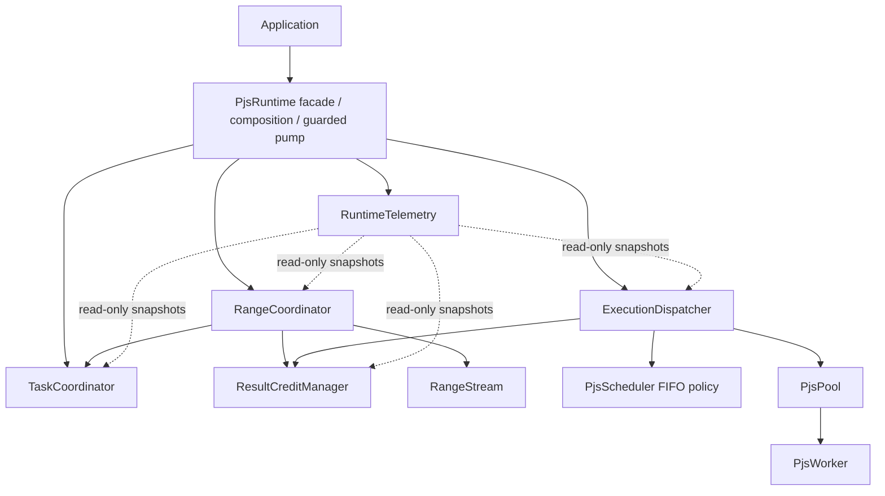

# v0.11 proposal: runtime core decomposition

## Decision summary

v0.11 is a behavior-preserving architecture milestone. It introduces no public
algorithm, scheduling policy, result semantic, memory contract, protocol
revision, or public API redesign. The runtime facade remains the only public
entry point, while independently reasoned mutable state machines move behind
explicit internal owners.

The extraction criterion is ownership, not file size: a component receives a
boundary only when it owns mutable state, lifecycle transitions, and invariants
that can be reasoned about independently.

## Existing state machines

### Runtime lifecycle

```text
created -> starting -> running -> stopping -> stopped
                    \-> failed -------------> stopped (after shutdown)
```

`PjsRuntime` remains the authority. The first shutdown call fixes drain mode.
Readiness, failure, and shutdown promise timing do not change.

### Worker lifecycle

```text
starting -> idle -> busy/scheduled -> busy/running -> idle
    |                     |                         |
    +---------------------+------------------------+-> failed -> replacement
                                                        \-> stopped
```

`PjsWorker` owns one physical execution slot and protocol correlation.
`PjsPool` owns population, repair, and restart limits. Caller cancellation does
not mutate worker occupancy.

### Task lifecycle

```text
created -> queued -> scheduled -> running -> completed
   |          |          |          +------> failed
   +----------+----------+-----------------> cancelled
   +----------+----------+-----------------> timed_out
```

Caller settlement and physical completion remain distinct. A running cancelled
task leaves the logical task map but its worker stays occupied until a result,
crash, or termination. Queue timestamps, signal callbacks, timers, transfer
claims, and synchronous settlement ordering remain unchanged.

### Range operation lifecycle

```text
created -> running -> completed
                   -> failed
                   -> cancelled
                   -> timed_out
```

The parent is host-owned and consumes no worker/FIFO slot. Terminal status is
written before sibling cancellation because sibling settlement is reentrant.
One `PjsRangeOperation` AsyncResource captures the caller context; factories and
parent settlement run in it and destroy is emitted exactly once.

### Result reservation lifecycle

```text
declared -> reserved -> queued -> dispatched -> executing
                                      |             |
                                      |             +-> execution ended
                                      +-> caller settled

successful: execution ended -> buffered/direct delivery -> yielded -> released
cancelled queued: caller settled -------------------------------> released
cancelled running: caller settled + execution ended ------------> released
```

The task ID owns one logical reservation. A physical task or batch correlation
owns the set of dispatched reservations until execution ends. Release is
idempotent. Operation cancellation releases queued, buffered, and already-ended
records, but never running credit before physical termination.

### Transfer ownership lifecycle

```text
application owned -> validated/snapshotted -> reserved while queued
                  -> postMessage in progress -> detached / worker owned
                  -> worker output transfer -> host owned result
```

Admission rejection and queued cancellation release a claim without detaching.
A getter can abort during `postMessage`; the transfer claim remains until the
post attempt finishes. Transfer ownership is never rolled back after a
successful post.

### Stream lifecycle

```text
created -> active -> buffered <-> waiting consumer -> completed
                  \-> direct yield                \-> failed
                  \-> consumer close/throw -------> cancelled
```

The stream starts eagerly, permits one consumer, delivers in completion order,
and counts consumer waiting against the operation deadline. Buffered successful
binary results retain reservation credit until yield. Close, failure, and
terminal operation cleanup discard buffers and release all non-running credit.

## Ownership matrix

| Concern                                     | v0.10 owner                       | v0.11 owner           | State owned                                                                            | May call/read                                           |
| ------------------------------------------- | --------------------------------- | --------------------- | -------------------------------------------------------------------------------------- | ------------------------------------------------------- |
| Runtime lifecycle and guarded progress loop | `PjsRuntime`                      | `PjsRuntime`          | runtime state, readiness/shutdown, pump guard                                          | coordinators and dispatcher                             |
| Worker population and repair                | `PjsPool`                         | `PjsPool`             | workers, repairs, restart counters                                                     | `PjsWorker`, typed callbacks                            |
| Physical worker execution                   | `PjsWorker`                       | `PjsWorker`           | worker state, current correlation, protocol phase                                      | worker thread, pool callbacks                           |
| FIFO policy                                 | `PjsScheduler`                    | `PjsScheduler`        | weighted queued entries                                                                | no runtime owner                                        |
| Logical task lifecycle                      | `PjsRuntime`                      | `TaskCoordinator`     | task records, timers/listeners, transfer release, task metrics                         | dispatcher admission port, parent-settlement hook       |
| Parent range lifecycle                      | `PjsRuntime`                      | `RangeCoordinator`    | operations, production cursor, result policy, parent/child accounting                  | task submission port, dispatch capacity, result credits |
| Result-byte credit                          | `PjsRuntime` and `RangeOperation` | `ResultCreditManager` | reservations, physical correlations, per-operation credit/mapping, current/peak credit | operation identity/capacity only                        |
| Physical dispatch                           | `PjsRuntime`                      | `ExecutionDispatcher` | admission reservations, reserved workers, dispatch counters                            | scheduler, pool, task transition port, result credits   |
| Stream buffer                               | `RangeStream`                     | `RangeStream`         | queue, waiter, terminal state, payload diagnostics                                     | explicit range callbacks                                |
| Metrics projection                          | `PjsRuntime`                      | `RuntimeTelemetry`    | no correctness state                                                                   | read-only component snapshots                           |

No coordinator receives `PjsRuntime` itself. Narrow synchronous ports express
the few upward transitions that must be reentrant. There is no generic event
bus, service locator, or asynchronous command layer.

## Target dependency direction



Pool callbacks enter through the composition root and are synchronously routed
to the owning component. Parent notification from task settlement is a narrow
typed transition, not authority for `TaskCoordinator` to mutate range state.

## Component decisions

### ResultCreditManager

Extract first. It owns logical reservation records, execution correlations,
per-operation reserved totals, partition-to-task mappings, aggregate current and
peak values, and its invariant scanner. Callers can reserve, correlate dispatch,
settle a caller, mark execution ended, release on yield, cancel an operation,
release all after worker termination, and request snapshots. No external code
can access or mutate the maps.

The manager uses operation identity plus declared capacity; it does not own
range status, workers, streams, or scheduling. This removes reservation-specific
mutable fields from `RangeOperation`.

### RangeCoordinator

Own operation registration, validation, lazy planning/production, deadlines,
round-robin producer rotation, parent/child bookkeeping, collection/discard/
stream/map result policy, map assembly, and parent settlement. It does not own
workers or FIFO policy. It asks the task layer to admit children and the dispatch
layer for bounded admission capacity.

`RangeOperation` remains an efficient host-owned state record and AsyncResource;
the coordinator owns transitions. The four result modes remain a discriminated
switch because separate strategy objects would add allocation and indirection
without reducing the current transition complexity.

### TaskCoordinator

Own logical task records, admission validation, task IDs/snapshots, signal and
timer cleanup, queued/running caller settlement, transfer claims, late-result
suppression, and logical metrics. Child records carry parent context, but only a
narrow synchronous parent-settlement transition can mutate range state.

The input factory may call `runtime.run()`, abort can fire during `postMessage`,
and promise resolution may synchronously enqueue continuation work. Therefore no
extra Promise, `queueMicrotask`, or `setImmediate` layer is inserted.

### ExecutionDispatcher

Own idle-worker selection, reserved idle slots, queue-credit reservations,
weighted FIFO insertion/dequeue, physical single/batch posting, logical-to-
physical correlation, and dispatch metrics. The scheduler alone chooses FIFO
order. The dispatcher does not decide which range partition to produce and does
not settle parent operations.

Logical task/partition metrics stay logical even when one physical message
carries several items.

### RuntimeTelemetry

Build the existing `stats()` shape from read-only snapshots. It owns no state
used for correctness and cannot perform lifecycle transitions. Field names and
meanings remain compatible.

## Pump and reentrancy

`PjsRuntime` retains the single progress loop:

```text
dispatch queued work
produce a bounded number of range batches
dispatch newly queued work
check drain completion
```

The existing `pumping` guard remains. Nested progress requests collapse into the
outer turn. A single immediate production continuation remains available when
credit exists after the bounded synchronous production budget.

Known synchronous reentrancy is intentional:

- an input factory may call `runtime.run()`;
- a transfer-list or payload getter may abort during dispatch;
- task settlement may immediately notify and finish a parent;
- finishing a parent synchronously cancels children;
- stream yield/demand/close may request progress;
- worker ready/result/failure callbacks may request progress;
- shutdown may begin from a factory.

State must be claimed before invoking application code or `postMessage`, and a
terminal parent state must be visible before cancelling siblings.

## Incremental validation plan

1. Capture v0.10 correctness and regression baselines.
2. Add characterization coverage only where an existing transition lacks it.
3. Extract `ResultCreditManager`; run focused binary tests, build, full tests,
   and invariant-enabled tests.
4. Extract `RangeCoordinator`; run range/completion/stream/map suites, build,
   and full tests.
5. Extract `TaskCoordinator`; run runtime/transfer/failure tests and full tests.
6. Extract `ExecutionDispatcher`; run batch/FIFO/protocol tests and full tests.
7. Extract read-only telemetry projection; compare representative snapshots.
8. Run final static checks, ten fresh stress rounds, reservation soak, invariant
   suite, and the candidate half of the regression matrix.

Any observed behavior change stops the extraction until classified. A genuine
bug requires a regression test and explicit report; otherwise the expected
semantic change count is zero.

## Performance constraints

The hot path keeps direct synchronous calls, mutable data-oriented task/
operation records, and existing Promise count. No generic transition objects,
event envelopes, graph traversal, protocol changes, or runtime dependencies are
introduced. A consistent regression above five percent on meaningful medium or
large workloads requires investigation; tiny no-op variance is reported rather
than hidden.

## Alternatives rejected

- Splitting `runtime.ts` by line range: moves code without establishing owners.
- A generic `RuntimeContext`: disguises the existing god object as a service
  locator.
- An internal event bus: obscures synchronous transition order and reentrancy.
- Generic operation/strategy frameworks: add abstractions without independent
  state or invariants.
- Moving queue policy into dispatch: prevents scheduler evolution and violates
  ADR 0003.
- Making `RangeOperation` own workers/tasks: combines policy with execution
  mechanism and recreates central coupling.
- Deferring every boundary behind Promises: changes timing, stack traces, async
  context, and allocation costs.

## Future design tests

- Upper-bound/refund reservations primarily change `ResultCreditManager` plus a
  narrow declaration/result hook in `RangeCoordinator` and worker validation.
- Adaptive grain sizing changes range planning/production policy.
- Work stealing changes scheduler/dispatch ownership without changing range or
  result-credit semantics.
- Cooperative cancellation changes task execution protocol, workers, and task
  coordination without spreading cancellation state across every subsystem.
